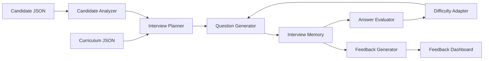

<<<<<<< HEAD
# 🎯 InterviewPilot AI

> **Build the interviewer, not the interview.**

InterviewPilot AI is an intelligent AI-powered technical interviewer that conducts **personalized, adaptive, multi-turn interviews** based on a candidate's learning journey through a 31-day AI Engineering Cohort.

Instead of asking scripted questions, InterviewPilot analyzes the candidate's completed curriculum, adapts question difficulty in real time, asks contextual follow-up questions, and generates actionable feedback—simulating the experience of a real senior technical interviewer.

---

## 🚀 Features

- 🧠 Personalized interviews based on candidate progress
- 💬 Multi-turn conversational interviewing
- 🔄 Dynamic follow-up questions
- 🎯 Adaptive difficulty adjustment
- 📝 Context-aware conversation memory
- 📊 Structured interview feedback
- 📚 Curriculum-driven questioning
- ⚡ Fast API backend
- 🎨 Modern responsive frontend
- 📈 Interactive interview analytics

---

## ✨ How It Works

```text
Candidate Profile
        │
        ▼
Candidate Analyzer
        │
        ▼
Interview Planner
        │
        ▼
Question Generator
        │
        ▼
AI Interview Engine
        │
        ▼
Answer Evaluation
        │
        ▼
Difficulty Adapter
        │
        ▼
Conversation Memory
        │
        ▼
Final Feedback Report
```

---

## 🏗️ Tech Stack

### Frontend

- React
- Vite
- TypeScript
- Tailwind CSS
- shadcn/ui
- Framer Motion

### Backend

- Node.js
- Express
- TypeScript

### AI

- OpenAI Responses API

### Deployment

- Vercel
- Render

---

## 📂 Project Structure

```
InterviewPilot-AI/

├── client/
│   ├── src/
│   ├── components/
│   ├── pages/
│   ├── hooks/
│   └── assets/
│
├── server/
│   ├── controllers/
│   ├── routes/
│   ├── services/
│   ├── prompts/
│   ├── memory/
│   ├── planner/
│   ├── evaluation/
│   ├── feedback/
│   ├── utils/
│   └── types/
│
├── shared/
│
├── docs/
│
├── prompts/
│
├── curriculum.json
├── candidates.json
├── README.md
├── PROMPTS.md
└── LICENSE
```

---

# 🎯 Interview Flow

```
Start Interview

↓

Analyze Candidate

↓

Generate Personalized Questions

↓

Evaluate Response

↓

Generate Follow-up

↓

Update Context

↓

Repeat

↓

Generate Final Feedback
```

---

## 📊 Feedback Report

Every completed interview generates a structured evaluation including:

- Executive Summary
- Technical Strengths
- Knowledge Gaps
- Communication Assessment
- Recommended Learning Topics
- Next Steps

---

## 🌟 Core Capabilities

- Adaptive Question Generation
- Curriculum-Aware Reasoning
- Candidate Progress Analysis
- Conversation Memory
- Difficulty Scaling
- Technical Feedback Generation
- AI-Powered Evaluation

---

## 🔥 Why InterviewPilot?

Traditional interview bots ask static questions.

InterviewPilot behaves like a **real senior engineer** by:

- Understanding what the candidate has already learned
- Asking relevant technical questions
- Generating intelligent follow-up questions
- Adapting difficulty dynamically
- Maintaining conversational context
- Providing constructive technical feedback

---

## 🛣️ Roadmap

- [ ] Core Interview Engine
- [ ] Candidate Analyzer
- [ ] Curriculum Parser
- [ ] Adaptive Question Generator
- [ ] Conversation Memory
- [ ] Feedback Engine
- [ ] Beautiful Frontend
- [ ] Deployment
- [ ] Analytics Dashboard
- [ ] Interview Transcript Export

---

## ⚙️ Local Development

```bash
# Clone Repository

git clone https://github.com/your-username/interviewpilot-ai.git

cd interviewpilot-ai
```

### Backend

```bash
cd server

npm install

npm run dev
```

### Frontend

```bash
cd client

npm install

npm run dev
```

---

## 🌍 Environment Variables

```env
OPENAI_API_KEY=your_api_key
```

---

## 📸 Screenshots

Coming soon...

---

## 📄 AI Usage Log

The project maintains a complete `PROMPTS.md` documenting all AI-assisted development prompts used throughout the hackathon.

---

## 🤝 Contributors

**Cyril Christopher J**  
Team Leader — K.S.R. College of Engineering

---

## 📜 License

MIT License

---

> **Built with AI. Guided by engineering. Designed for real technical interviews.**
=======
# InterviewPilot AI

InterviewPilot AI is a session-based technical interview engine for a 31-day AI Engineering Cohort. It analyzes a candidate's completed missions, skipped topics, attempts, and learning signals, then conducts an adaptive senior-engineer-style interview with memory, follow-up questions, difficulty adjustment, and structured feedback.

## Features

- `POST /api/interview` single interview endpoint matching the provided technical specification
- Session memory keyed by `sessionId`
- Minimum 8-question interviews covering at least 4 curriculum days
- Dynamic curriculum mapping from `server/data/curriculum.json`
- Candidate-aware planning from `server/data/candidates.json` or request-provided candidate objects
- Follow-up generation, answer evaluation, adaptive difficulty, and duplicate-question prevention
- Final feedback with `summary`, `strengths[]`, `gaps[]`, and `next[]`
- Feedback dashboard with radar chart, topic timeline, transcript, PDF print/export, copy transcript, restart, and share results
- OpenAI Responses API integration with Structured Outputs when `OPENAI_API_KEY` is configured
- Offline deterministic evaluator so judges can demo the product without credentials

## Architecture



## Tech Stack

- Frontend: React, Vite, TypeScript, TailwindCSS, Framer Motion, Recharts, Lucide icons
- Backend: Node.js, Express, TypeScript, Zod
- AI: OpenAI Responses API via `POST /v1/responses`
- State: in-memory session store keyed by `sessionId`

## Installation

```bash
npm install
cp server/.env.example server/.env
npm run dev
```

The frontend runs at `http://localhost:5173` and proxies `/api` to the backend at `http://localhost:4000`.

## Environment Variables

```bash
OPENAI_API_KEY=sk-...
OPENAI_MODEL=gpt-5
PORT=4000
CLIENT_ORIGIN=http://localhost:5173
```

When `OPENAI_API_KEY` is absent, the backend runs in deterministic local mode while preserving the same API contract.

## API

### Start

```http
POST /api/interview
Content-Type: application/json

{
  "sessionId": "demo-123",
  "candidateId": "CAND-003"
}
```

You may also pass a full candidate object:

```json
{
  "sessionId": "demo-123",
  "candidate": { "member": { "id": "CAND-003" }, "missions": [], "signals": {} }
}
```

### Turn

```json
{
  "sessionId": "demo-123",
  "message": "I would first inspect retrieval traces and compare query intent..."
}
```

### Final

```json
{
  "reply": "Interview completed.",
  "done": true,
  "feedback": {
    "summary": "...",
    "strengths": [],
    "gaps": [],
    "next": []
  }
}
```

The UI also calls the same endpoint with `{ "action": "catalog" }` to load candidate summaries without adding a second API route.

## Folder Structure

```text
client/     React interview cockpit and feedback dashboard
server/     Express API, interview engine, AI modules, memory, data loaders
shared/     API contract notes
docs/       Provided technical specification
prompts/    Modular production prompts
```

## Screenshots

- Landing cockpit: candidate profile, topic readiness, and start controls
- Interview screen: typing reply, question counter, confidence meter, timeline, and transcript
- Feedback page: radar chart, topic history, strong/weak topics, and recommendations

## Deployment

- Frontend: Vercel, build command `npm run build --workspace client`, output `client/dist`
- Backend: Render, build command `npm install && npm run build --workspace server`, start command `npm run start --workspace server`

## Future Improvements

- Redis-backed distributed session memory
- Authenticated candidate invitations
- Voice-mode interviewing
- Judge-facing replay mode with transcript scoring rationale
>>>>>>> f5fe3a6 (feat: initialize InterviewPilot AI architecture)
