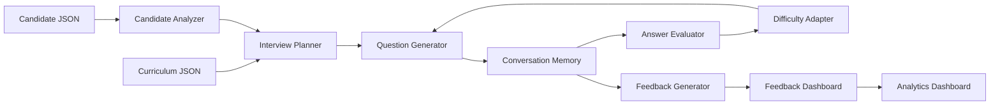

Yes BOSS. Below is the **complete `README.md`**, aligned with your current GitHub repo and actual implementation. Your repo currently has the `client`, `server`, `shared`, `docs`, `prompts`, and `PROMPTS.md` structure, and the deployed Vercel URL is already associated with the repository. ([GitHub][1])

**Replace your entire `README.md` with this single block:**

````markdown
# 🎯 InterviewPilot AI

> **Build the interviewer, not the interview.**

[](https://interviewpilot-ai-eight.vercel.app/)
[](https://github.com/cyrilchris-j/InterviewPilot-AI)
[](https://openai.com/)
[](https://www.typescriptlang.org/)
[](https://react.dev/)

## 🚀 Live Demo

**Production:**  
https://interviewpilot-ai-eight.vercel.app/

**Repository:**  
https://github.com/cyrilchris-j/InterviewPilot-AI

---

# 🧠 What is InterviewPilot AI?

InterviewPilot AI is an **adaptive AI technical interview engine** designed for a **31-day Enterprise AI Engineering Cohort**.

Instead of asking every candidate the same fixed list of questions, InterviewPilot analyzes the candidate's learning journey and dynamically builds an interview around:

- Completed missions
- Skipped topics
- Previous attempts
- Learning signals
- Strengths
- Weak areas
- Current understanding
- Interview performance

The system then conducts a multi-turn technical interview, evaluates answers, adapts difficulty, asks contextual follow-ups, maintains conversation memory, and produces a structured curriculum-linked assessment.

### Core idea

```text
Candidate Learning History
            ↓
      Candidate Analysis
            ↓
   Personalized Interview Plan
            ↓
      Adaptive Interview
            ↓
     Answer Evaluation
            ↓
    Difficulty Adaptation
            ↓
    Contextual Follow-ups
            ↓
     Final Assessment
            ↓
 Curriculum-linked Learning Path
````

---

# 🎯 Problem Statement

The goal is to build an **AI Interview Agent** for a 31-day Enterprise AI Engineering cohort.

The agent must assess whether a candidate actually understands the concepts they have learned across topics such as:

* Retrieval-Augmented Generation
* Vector Databases
* Prompt Engineering
* Agentic AI
* MCP
* AI Deployment
* Production AI Systems
* AI Architecture
* Production Trade-offs

The challenge is not simply generating questions.

The challenge is building an interviewer that can:

1. Understand the candidate's learning history.
2. Select relevant curriculum areas.
3. Conduct a natural technical conversation.
4. Ask intelligent follow-up questions.
5. Increase or decrease difficulty based on answers.
6. Maintain context across multiple turns.
7. Avoid repetitive questions.
8. Produce actionable feedback tied back to the curriculum.

---

# 💡 Our Solution

InterviewPilot AI separates **interview intelligence** from the user interface.

The system first builds a candidate profile from the supplied learning data.

It then creates an interview plan based on:

* Candidate strengths
* Candidate weaknesses
* Skipped concepts
* Failed or repeated attempts
* Curriculum priorities
* Interview progression

During the interview, every answer becomes new context.

That context influences the next question.

### Adaptive loop

```text
Question
   ↓
Candidate Answer
   ↓
Answer Evaluation
   ↓
Identify Strengths / Gaps
   ↓
Adjust Difficulty
   ↓
Generate Follow-up
   ↓
Next Question
```

This makes the interview **dynamic rather than scripted**.

---

# ⭐ Key Differentiator

## Static candidate data ≠ static interview behavior

The supplied candidate profiles are used as **learning histories**, not as hardcoded interview scripts.

The same interview engine can evaluate different candidates.

For example:

```text
Candidate A
Strong RAG
Weak Agentic AI
Skipped MCP
        ↓
Interview emphasizes
RAG depth + Agentic AI + MCP recovery
```

while:

```text
Candidate B
Strong Agents
Weak Vector Databases
Repeated RAG attempts
        ↓
Interview emphasizes
Vector DB fundamentals + RAG architecture
```

The engine remains the same.

The interview path changes.

---

# 🏗️ System Architecture



---

# 🔄 Interview Intelligence Pipeline

## 1. Candidate Analysis

The candidate profile is analyzed to identify:

* Completed days
* Skipped days
* Failed attempts
* Repeated attempts
* Strong areas
* Weak areas
* Learning confidence
* Difficulty recommendation
* Risk areas

---

## 2. Interview Planning

The planner creates a structured interview progression.

Typical stages include:

```text
Warmup
   ↓
Concept
   ↓
Scenario
   ↓
Architecture
   ↓
Trade-off
   ↓
Production
   ↓
Advanced
   ↓
Reflection
```

Difficulty can progress through:

```text
Easy → Medium → Hard
```

depending on candidate performance.

---

## 3. Question Generation

Questions are generated using:

* Candidate profile
* Curriculum topic
* Interview stage
* Current difficulty
* Previous questions
* Previous answers
* Previous evaluations
* Conversation memory

The system also prevents duplicate questions.

---

## 4. Answer Evaluation

Each answer is evaluated across multiple dimensions:

| Dimension               | Purpose                          |
| ----------------------- | -------------------------------- |
| Correctness             | Technical accuracy               |
| Depth                   | Conceptual understanding         |
| Confidence              | Clarity and certainty            |
| Practical Understanding | Ability to apply concepts        |
| Communication           | Explanation quality              |
| Reasoning               | Logical thinking                 |
| Production Thinking     | Real-world engineering awareness |
| Architecture Thinking   | System-level reasoning           |

Each dimension is scored on a **1–5 scale**.

---

## 5. Adaptive Difficulty

The interviewer responds to performance.

### Strong answer

```text
Strong answer
     ↓
Increase difficulty
     ↓
Deeper scenario
     ↓
Architecture / trade-off question
```

### Weak answer

```text
Weak answer
     ↓
Identify gap
     ↓
Scaffolded follow-up
     ↓
Test understanding again
```

The goal is to determine whether the candidate actually understands the concept instead of simply moving to the next predefined question.

---

# 🧠 Conversation Memory

InterviewPilot maintains session-level conversation state.

The memory tracks:

* Questions asked
* Candidate answers
* Topics covered
* Evaluation scores
* Mistakes
* Strengths
* Weaknesses
* Difficulty progression
* Follow-up context

This enables questions such as:

```text
"You mentioned caching in your previous answer.
How would your design change if the vector database
became the main latency bottleneck?"
```

rather than treating every answer as an isolated interaction.

---

# 📊 Final Assessment

After the interview, the system generates structured feedback.

The final assessment contains:

```text
Summary
Strengths
Gaps
Next Steps
Topic Scores
Recommended Curriculum Days
Learning Path
Overall Rating
```

Example:

```json
{
  "summary": "Strong understanding of RAG fundamentals...",
  "strengths": [
    "Retrieval architecture",
    "Prompt design",
    "Production reasoning"
  ],
  "gaps": [
    "Vector database optimization",
    "Agent reliability"
  ],
  "next": [
    "Review vector indexing",
    "Practice agent evaluation patterns"
  ],
  "overallRating": "Strong"
}
```

The assessment is therefore not just an interview score.

It becomes a **personalized learning recommendation**.

---

# 📈 Analytics Dashboard

The application provides a structured post-interview analysis including:

* Overall score
* Topic-level performance
* Strength areas
* Weak areas
* Session timeline
* Recommendations
* Full transcript
* Radar visualization
* Learning path
* JSON report export
* PDF report export

This allows the candidate to understand **what they know, what they don't know, and what to study next**.

---

# 🤖 AI Architecture

InterviewPilot supports two execution modes.

## AI Mode

When `OPENAI_API_KEY` is configured:

```text
Application
     ↓
OpenAI Responses API
     ↓
Structured Output
     ↓
Validated Application State
```

AI is used for:

* Question generation
* Answer evaluation
* Feedback generation

Structured outputs are validated before being used by the application.

---

## Offline Deterministic Mode

When an OpenAI API key is unavailable, the application falls back to deterministic logic.

This provides:

* Reliable local development
* Demo resilience
* Testability
* Predictable fallback behavior

Therefore the application does not completely fail when AI credentials are unavailable.

---

# 🛠️ Tech Stack

| Layer      | Technology                         |
| ---------- | ---------------------------------- |
| Frontend   | React 18                           |
| Build Tool | Vite                               |
| Language   | TypeScript                         |
| Styling    | TailwindCSS                        |
| Animation  | Framer Motion                      |
| Charts     | Recharts                           |
| Icons      | Lucide                             |
| Backend    | Node.js                            |
| API        | Express                            |
| Validation | Zod                                |
| AI         | OpenAI Responses API               |
| State      | In-memory session store            |
| Testing    | node:test, Vitest, Testing Library |
| Deployment | Vercel / Render / Docker           |

---

# 📂 Project Structure

```text
InterviewPilot-AI/
│
├── client/
│   └── src/
│       ├── components/
│       │   ├── Landing/
│       │   ├── InterviewScreen/
│       │   ├── FeedbackDashboard/
│       │   ├── AnalyticsDashboard/
│       │   └── UI/
│       │
│       ├── lib/
│       │   ├── api/
│       │   ├── session/
│       │   ├── theme/
│       │   └── utilities/
│       │
│       └── types.ts
│
├── server/
│   ├── data/
│   │   ├── candidates.json
│   │   └── curriculum.json
│   │
│   └── src/
│       ├── ai/
│       │   ├── OpenAI client
│       │   ├── prompt store
│       │   └── AI services
│       │
│       ├── candidate/
│       │   ├── repository
│       │   ├── profile builder
│       │   └── scoring
│       │
│       ├── curriculum/
│       │   └── curriculum repository
│       │
│       ├── planner/
│       │   └── interview planning engine
│       │
│       ├── interview/
│       │   ├── interview engine
│       │   ├── question generator
│       │   └── difficulty adapter
│       │
│       ├── evaluation/
│       │   └── answer evaluator
│       │
│       ├── feedback/
│       │   ├── feedback generator
│       │   └── turn summaries
│       │
│       ├── memory/
│       │   └── conversation memory
│       │
│       ├── sessions/
│       │   └── session manager
│       │
│       ├── controllers/
│       ├── routes/
│       ├── middleware/
│       ├── validation/
│       └── config/
│
├── shared/
│   └── API contract notes
│
├── docs/
│   └── technical specification
│
├── prompts/
│   ├── system.md
│   ├── planner.md
│   ├── question.md
│   ├── evaluation.md
│   └── feedback.md
│
├── PROMPTS.md
├── Dockerfile
├── docker-compose.yml
├── package.json
├── package-lock.json
└── README.md
```

---

# 📡 API

The primary interview endpoint is:

```text
POST /api/interview
```

---

## Start an Interview

### Request

```json
{
  "sessionId": "demo-123",
  "candidateId": "CAND-003"
}
```

A complete candidate object can also be supplied directly.

### Response

```json
{
  "reply": "Welcome. Let's begin your interview.",
  "done": false
}
```

---

## Submit an Answer

```json
{
  "sessionId": "demo-123",
  "message": "I would trace the retrieval path, inspect latency metrics, and validate the fix."
}
```

The system evaluates the answer and generates the next interview turn.

---

## Completed Interview

```json
{
  "reply": "Interview completed.",
  "done": true,
  "feedback": {
    "summary": "...",
    "strengths": [],
    "gaps": [],
    "next": [],
    "topicScores": [],
    "recommendedDays": [],
    "learningPath": [],
    "overallRating": "Strong"
  }
}
```

---

# 🎛️ Control Actions

The same endpoint supports application control actions.

## Candidate Catalog

```json
{
  "action": "catalog"
}
```

Returns candidate summaries used by the landing experience.

## Reset Session

```json
{
  "action": "reset"
}
```

Clears an interview session.

---

# ⚙️ Environment Variables

Create:

```text
server/.env
```

based on:

```text
server/.env.example
```

### Variables

| Variable              | Default                 | Purpose                    |
| --------------------- | ----------------------- | -------------------------- |
| `OPENAI_API_KEY`      | —                       | Enables OpenAI AI services |
| `OPENAI_MODEL`        | `gpt-5`                 | OpenAI Responses API model |
| `PORT`                | `4000`                  | Backend port               |
| `CLIENT_ORIGIN`       | `http://localhost:5173` | Allowed frontend origin    |
| `SESSION_TTL_MINUTES` | `120`                   | Session lifetime           |
| `REQUEST_BODY_LIMIT`  | `1mb`                   | Maximum request size       |
| `LOG_LEVEL`           | `info`                  | Application logging level  |

### Important

Never commit:

```text
.env
```

to GitHub.

Use:

```text
.env.example
```

for documenting required configuration.

---

# 🚀 Local Development

## Requirements

* Node.js 20+
* npm
* OpenAI API key for AI mode

---

## Install

```bash
npm install
```

---

## Configure Environment

```bash
cp server/.env.example server/.env
```

Add your API key:

```env
OPENAI_API_KEY=your_api_key_here
OPENAI_MODEL=gpt-5
```

---

## Start Development Server

```bash
npm run dev
```

The application runs at:

```text
Frontend:
http://localhost:5173

Backend:
http://localhost:4000
```

Health check:

```text
GET /api/health
```

---

# 🧪 Testing

Run the complete test suite:

```bash
npm test
```

Run lint/type checks:

```bash
npm run lint
```

Build the application:

```bash
npm run build
```

Recommended validation before submission:

```bash
npm test
npm run lint
npm run build
```

---

# 🔐 Security & Reliability

The backend includes several production-oriented safeguards:

* Zod request validation
* Helmet security headers
* Request body limits
* Rate limiting
* Compression
* Centralized error handling
* Session TTL
* Environment-based secrets
* No API keys exposed to the frontend
* Deterministic fallback when AI credentials are unavailable

---

# 🐳 Docker

The repository includes:

```text
Dockerfile
docker-compose.yml
```

Run:

```bash
docker-compose up -d
```

Stop:

```bash
docker-compose down
```

---

# ☁️ Deployment

## Frontend

The frontend can be deployed using Vercel.

Build command:

```bash
npm run build --workspace client
```

Output:

```text
client/dist
```

A Vercel configuration is included for SPA routing.

---

## Backend

The backend can be deployed using Render or Docker.

Standard build:

```bash
npm install && npm run build --workspace server
```

Start:

```bash
npm run start --workspace server
```

For production AI mode, configure:

```env
OPENAI_API_KEY=...
OPENAI_MODEL=gpt-5
CLIENT_ORIGIN=https://your-frontend-domain.com
```

---

# 🏆 Hackathon Requirement Mapping

InterviewPilot AI directly addresses the core requirements of the Interview Agent problem.

| Requirement                        | Implementation                                      |
| ---------------------------------- | --------------------------------------------------- |
| Conversational technical interview | Multi-turn interview engine                         |
| Minimum 8 questions                | Interview planner generates a multi-stage interview |
| At least 4 curriculum days         | Planner selects multiple curriculum areas           |
| Follow-up questions                | Answer evaluation + adaptive question generation    |
| Maintain context                   | Session-level conversation memory                   |
| Candidate personalization          | Candidate Analyzer + learning history               |
| Adaptive interview                 | Difficulty Adapter                                  |
| Avoid repetition                   | Question normalization + duplicate prevention       |
| Structured feedback                | Feedback Generator                                  |
| Curriculum-linked recommendations  | Topic scores + recommended days + learning path     |
| AI integration                     | OpenAI Responses API                                |
| Demo reliability                   | Deterministic offline fallback                      |
| AI development transparency        | `PROMPTS.md`                                        |

---

# 🧩 Why This Architecture?

A simple chatbot can generate interview questions.

InterviewPilot is designed as an **interview system**.

The distinction is:

```text
Simple AI Chatbot
      ↓
Question
      ↓
Answer
      ↓
Question
```

versus:

```text
InterviewPilot AI

Candidate History
      ↓
Candidate Analysis
      ↓
Interview Planning
      ↓
Question Generation
      ↓
Conversation Memory
      ↓
Answer Evaluation
      ↓
Difficulty Adaptation
      ↓
Contextual Follow-up
      ↓
Performance Assessment
      ↓
Learning Recommendations
```

The second architecture explicitly models the interviewer as a stateful decision-making system.

---

# 🔬 AI Usage

AI is not used as an uncontrolled text generator.

The application uses structured AI responsibilities.

### Question Generation

Produces technically relevant questions based on the current interview state.

### Answer Evaluation

Converts free-form answers into structured evaluation signals.

### Feedback Generation

Converts the complete interview context into an actionable assessment.

### Deterministic Components

Important application behavior remains deterministic where appropriate:

* Candidate analysis
* Interview planning
* Duplicate prevention
* Session management
* Topic aggregation
* Recommended curriculum mapping
* Offline fallback

This separation improves predictability and testability.

---

# 📄 AI Usage Log

The complete AI-assisted development history is documented in:

```text
PROMPTS.md
```

This file contains the prompts used during development and explains how AI assistance was used to build the system.

For hackathon submission, the public AI Usage Log is:

```text
https://github.com/cyrilchris-j/InterviewPilot-AI/blob/main/PROMPTS.md
```

---

# 🎥 Recommended Demo Flow

A strong product demonstration follows this sequence:

```text
1. Open InterviewPilot AI
          ↓
2. Select a candidate
          ↓
3. Show their learning history
          ↓
4. Start personalized interview
          ↓
5. Answer the first question
          ↓
6. Demonstrate contextual follow-up
          ↓
7. Demonstrate difficulty adaptation
          ↓
8. Continue across multiple curriculum topics
          ↓
9. Complete interview
          ↓
10. Show structured feedback
          ↓
11. Show topic-level analytics
          ↓
12. Show recommended learning path
```

The important story is:

> **The candidate's learning journey changes the interview.**

---

# 🧠 Design Philosophy

InterviewPilot follows five principles:

### 1. Personalization

The candidate should not receive an arbitrary interview.

Their learning history should influence the interview.

### 2. Context

A candidate's previous answers should affect future questions.

### 3. Adaptation

The interviewer should respond to demonstrated understanding.

### 4. Evidence

Assessment should be based on observed answers rather than assumptions.

### 5. Actionability

The final result should tell the candidate what to improve next.

---

# 📌 Project Scope

## Included

* AI technical interviews
* Candidate personalization
* Curriculum-aware planning
* Multi-turn conversation
* Follow-up questions
* Difficulty adaptation
* Conversation memory
* Answer evaluation
* Structured feedback
* Analytics
* Learning recommendations
* JSON/PDF report export
* Offline deterministic mode

## Intentionally Out of Scope

The project does not attempt to implement:

* Authentication
* Persistent user accounts
* Voice interviews
* Mobile applications
* Long-term conversation history
* Generic recruitment/job databases
* Resume building
* LinkedIn integration

The implementation remains focused on the specified **AI Interview Agent** problem.

---

# 📊 Product Flow

```text
┌───────────────────────────────┐
│       Candidate Profile       │
│                               │
│ Completed / Skipped / Attempts│
│ Learning Signals / Weak Areas │
└───────────────┬───────────────┘
                │
                ▼
┌───────────────────────────────┐
│      Candidate Analyzer       │
└───────────────┬───────────────┘
                │
                ▼
┌───────────────────────────────┐
│       Interview Planner        │
│                               │
│ Topics / Stages / Difficulty  │
└───────────────┬───────────────┘
                │
                ▼
┌───────────────────────────────┐
│       Adaptive Interview      │
│                               │
│ Question → Answer → Evaluate  │
│      ↑                │       │
│      └── Adapt ───────┘       │
└───────────────┬───────────────┘
                │
                ▼
┌───────────────────────────────┐
│       Final Assessment        │
│                               │
│ Strengths / Gaps / Scores     │
│ Recommendations / Learning    │
└───────────────────────────────┘
```

---

# 📁 Important Files

| File                          | Purpose                             |
| ----------------------------- | ----------------------------------- |
| `README.md`                   | Project documentation               |
| `PROMPTS.md`                  | AI-assisted development log         |
| `server/data/candidates.json` | Candidate profiles                  |
| `server/data/curriculum.json` | 31-day curriculum                   |
| `prompts/question.md`         | Question-generation prompt          |
| `prompts/evaluation.md`       | Answer-evaluation prompt            |
| `prompts/feedback.md`         | Feedback-generation prompt          |
| `prompts/planner.md`          | Interview-planning prompt reference |
| `prompts/system.md`           | Interview-agent system behavior     |
| `Dockerfile`                  | Container deployment                |
| `docker-compose.yml`          | Local container orchestration       |

---

# 🌐 Links

### Live Application

[https://interviewpilot-ai-eight.vercel.app/](https://interviewpilot-ai-eight.vercel.app/)

### GitHub Repository

[https://github.com/cyrilchris-j/InterviewPilot-AI](https://github.com/cyrilchris-j/InterviewPilot-AI)

### AI Usage Log

[https://github.com/cyrilchris-j/InterviewPilot-AI/blob/main/PROMPTS.md](https://github.com/cyrilchris-j/InterviewPilot-AI/blob/main/PROMPTS.md)

---

# 🚀 Project Status

**Status: Hackathon-ready**

The project provides:

* A working web interface
* Candidate-driven interview planning
* Multi-turn interview sessions
* AI-powered question generation
* AI-powered answer evaluation
* Adaptive follow-ups
* Difficulty adjustment
* Structured final feedback
* Curriculum-linked recommendations
* Analytics
* Offline fallback
* Public repository
* AI usage documentation

---

# 🏁 Submission Checklist

Before submitting:

```text
[ ] GitHub repository is public
[ ] Live demo is accessible
[ ] README is updated
[ ] PROMPTS.md is public
[ ] AI Usage Log URL points to PROMPTS.md
[ ] No API keys are committed
[ ] .env is ignored
[ ] npm test passes
[ ] npm run lint passes
[ ] npm run build passes
[ ] POST /api/interview works
[ ] Candidate selection works
[ ] Interview reaches completion
[ ] Final feedback is generated
[ ] Demo flow has been rehearsed
```

---

# 🎯 Final Pitch

> **InterviewPilot AI transforms a candidate's learning history into a living technical interview.**
>
> It does not simply ask questions.
>
> It analyzes what the candidate has learned, identifies where they are strong or weak, plans an interview around that evidence, adapts the conversation based on their answers, and converts the result into a curriculum-linked learning path.
>
> **The result is an interviewer that adapts to the candidate — not a questionnaire that happens to use AI.**

---

## Built with AI. Guided by engineering. Designed for real technical interviews.

**InterviewPilot AI**

```
```

[1]: https://github.com/cyrilchris-j/InterviewPilot-AI "GitHub - cyrilchris-j/InterviewPilot-AI · GitHub"
