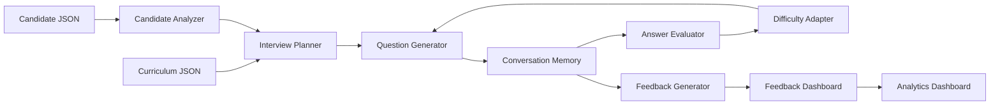

# 🎯 InterviewPilot AI

> **Build the interviewer, not the interview.**

InterviewPilot AI is a session-based, AI-powered technical interview engine for a 31-day AI Engineering Cohort. It analyzes a candidate's completed missions, skipped topics, attempts, and learning signals, then conducts an adaptive, senior-engineer-style interview with conversation memory, follow-up questions, difficulty adjustment, structured feedback, and a full analytics dashboard.

## ✨ Features

- **Personalized interviews** — every session is planned from the candidate's real cohort history (`candidateId` or an inline `candidate` object)
- **Multi-turn conversations** — memory tracks topics, scores, and mistakes across turns
- **Adaptive difficulty** — strong answers raise the bar, weak answers trigger a scaffolded follow-up
- **Duplicate prevention** — normalized question keys guarantee the plan never repeats itself
- **Structured feedback** — `summary`, `strengths[]`, `gaps[]`, `next[]`, per-topic scores, recommended days, and a learning path
- **Analytics dashboard** — overall score ring, radar chart, session timeline, strong/weak topics, recommendations, full transcript, and JSON/PDF report export
- **OpenAI Responses API** — structured JSON outputs when `OPENAI_API_KEY` is set
- **Offline mode** — a deterministic evaluator keeps the product fully demoable without credentials

## 🏗️ Architecture



## 🧰 Tech Stack

| Layer | Technology |
| --- | --- |
| Frontend | React 18, Vite, TypeScript, TailwindCSS, Framer Motion, Recharts, Lucide icons |
| Backend | Node.js, Express, TypeScript, Zod |
| AI | OpenAI Responses API with Structured Outputs (`text.format.type = "json_schema"`) |
| State | In-memory session store keyed by `sessionId` (with TTL) |
| Tests | `node:test` (server) and Vitest + Testing Library (client) |

## 📂 Project Structure

```text
.
├── client/                 React interview cockpit and feedback/analytics dashboards
│   └── src/
│       ├── components/     Landing, InterviewScreen, FeedbackDashboard, AnalyticsDashboard, UI primitives
│       ├── lib/            API client, theme, session, utilities
│       └── types.ts        Shared client-side API types
├── server/
│   └── src/
│       ├── ai/             OpenAI Responses API client, prompt store, services
│       ├── candidate/      Candidate repository, profile builder, scoring
│       ├── curriculum/     Curriculum repository
│       ├── planner/        Interview planning engine
│       ├── interview/      Interview engine, question generator, difficulty adapter
│       ├── evaluation/     Answer evaluator (deterministic fallback)
│       ├── feedback/       Feedback generator and turn summaries
│       ├── memory/         Conversation memory
│       ├── sessions/       Session manager
│       ├── controllers/    HTTP handlers
│       ├── routes/         Express routes
│       ├── middleware/     Rate limiter, compression, helmet, error handling
│       ├── validation/     Zod request schemas
│       └── config/         Environment configuration
├── shared/                 API contract notes
├── docs/                   Provided technical specification
├── prompts/                Modular production prompts (system, planner, question, evaluation, feedback)
└── server/data/            candidates.json, curriculum.json
```

## 🚀 Getting Started

Requires **Node.js 20+**.

```bash
npm install
cp server/.env.example server/.env
npm run dev
```

- Frontend: `http://localhost:5173` (proxies `/api` to the backend)
- Backend: `http://localhost:4000`
- Health check: `GET /api/health`

## ⚙️ Environment Variables

See `server/.env.example`:

| Variable | Default | Purpose |
| --- | --- | --- |
| `OPENAI_API_KEY` | — | Enables AI services. When absent, a deterministic offline evaluator runs. |
| `OPENAI_MODEL` | `gpt-5` | Model used by the Responses API |
| `PORT` | `4000` | Backend port |
| `CLIENT_ORIGIN` | `http://localhost:5173` | Allowed CORS origin |
| `SESSION_TTL_MINUTES` | `120` | Interview session lifetime |
| `REQUEST_BODY_LIMIT` | `1mb` | Max JSON request body size |
| `LOG_LEVEL` | `info` | `debug` / `info` / `warn` / `error` |

## 📡 API

The single required endpoint is `POST /api/interview`.

### Start an interview

```http
POST /api/interview
Content-Type: application/json

{
  "sessionId": "demo-123",
  "candidateId": "CAND-003"
}
```

You may also pass a full candidate object (matching the schema in `server/data/candidates.json`).

### Answer a turn

```json
{
  "sessionId": "demo-123",
  "message": "I would trace the retrieval path, check metrics, and validate a fix."
}
```

### Completed interview

```json
{
  "reply": "Interview completed.",
  "done": true,
  "feedback": {
    "summary": "...",
    "strengths": [],
    "gaps": [],
    "next": [],
    "topicScores": [],
    "recommendedDays": [],
    "learningPath": [],
    "overallRating": "Strong"
  }
}
```

Control actions (same endpoint):

- `{ "action": "catalog" }` — list candidate summaries for the landing page
- `{ "action": "reset" }` — clear a session

## 🧪 Testing

```bash
npm test                # server (node:test) + client (vitest)
npm run lint            # typecheck for both workspaces
npm run build           # compile server + client
```

## ☁️ Deployment

- **Frontend (Vercel)** — build command `npm run build --workspace client`, output `client/dist`. A `vercel.json` is provided for SPA routing.
- **Backend (Render / Docker)** — 
  - Standard: build command `npm install && npm run build --workspace server`, start command `npm run start --workspace server`.
  - Docker: `docker-compose up -d` (uses the provided `Dockerfile` and `docker-compose.yml`).

Set `CLIENT_ORIGIN` to your deployed frontend origin and `OPENAI_API_KEY` to enable AI mode.

## 📄 AI Usage Log

`PROMPTS.md` documents every AI-assisted development prompt used during the hackathon.

---

> **Built with AI. Guided by engineering. Designed for real technical interviews.**
